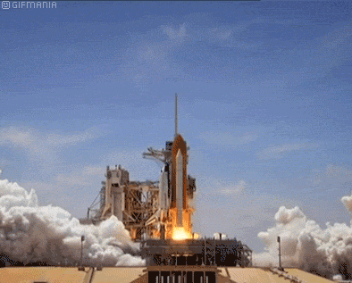

## INTRODUCCIÓN
SpaceX is an American aerospace manufacturing and space transportation services company headquartered in Hawthorne, California. It was founded in 2002 by Elon Musk with the goal of reducing the cost of space travel to facilitate the colonization of Mars. SpaceX's achievements include:

Sending spacecraft to the International Space Station.
Starlink, a satellite internet constellation providing satellite internet access.
Sending crewed missions to space.
One of the reasons SpaceX can accomplish this is that rocket launches are relatively cost-effective. SpaceX advertises Falcon 9 rocket launches on its website at a cost of $62 million, while other providers charge over $165 million per launch. Much of the savings comes from SpaceX's ability to reuse the first stage. Therefore, if we can determine whether the first stage will land, we can estimate the cost of a launch. The second stage helps place the payload into orbit, but most of the work is done by the first stage, which is quite large and expensive. Unlike other rocket providers, SpaceX's Falcon 9 can recover the first stage. Sometimes, the first stage does not land, sometimes it crashes, and other times, SpaceX sacrifices the first stage due to mission parameters such as payload, orbit, and client requirements.

In this final phase, I will take on the role of a data scientist working for a new space rocket company, Space Y, which aims to compete with SpaceX. My job will be to determine whether Falcon 9 will reuse the first stage and thereby predict the cost of each launch. To achieve this, I will gather public information about SpaceX's Falcon 9 launches and create dashboards for my team at Space Y. I will build and train a machine learning model that I will use to make predictions about the success of the launches.

Let the action begin!

## DATA COLLECTION

* Import Libraries and Define Auxiliary Functions
* Request to SpaceX API.
* Filter the dataframe to only include Falcon 9 launches.
* Dealing with Missing Values.

## WEBSCRAPING

* Web-scraping to collect Falcon 9 historical launch records from a Wikipedia page titled [List of Falcon 9 and Falcon Heavy launches](https://en.wikipedia.org/wiki/List_of_Falcon_9_and_Falcon_Heavy_launches).

* Import Libraries and Define Auxiliary Functions.
* Request the Falcon9 Launch Wiki page from its URL.
* Extract all column/variable names from the HTML table header.
* Create a data frame by parsing the launch HTML tables.

## EXPLORATORY DATA ANALYSIS (EDA)

* Import Libraries and Define Auxiliary Functions.
* Calculate the number of launches on each site.
* Calculate the number and occurrence of each orbit.
* Calculate the number and occurence of mission outcome of the orbits.
* Create a landing outcome label from Outcome column.

## EXPLORATORY DATA ANALYSIS (EDA) WITH VISUALIZATIONS

* Import Libraries and Define Auxiliary Functions.
* Visualize the relationship between Flight Number and Launch Site.
* Visualize the relationship between Payload and Launch Site.
* Visualize the relationship between success rate of each orbit type.
* Visualize the relationship between FlightNumber and Orbit type.
* Visualize the relationship between Payload and Orbit type.
* Visualize the launch success yearly trend.
* Create dummy variables to categorical columns.
* Cast all numeric columns to float64.

## EXPLORATORY DATA ANALYSIS (EDA) WITH SQL

* Download the datasets.[You can see here](https://github.com/Mai-de-jerez/IBM_Applied_Data_Science_Capstone/blob/main/DATASET/Spacex.csv)
* Connect to the database.
* Display the names of the unique launch sites in the space mission.
* Display 5 records where launch sites begin with the string 'CCA'.
* Display the total payload mass carried by boosters launched by NASA (CRS).
* Display average payload mass carried by booster version F9 v1.1.
* List the date when the first succesful landing outcome in ground pad was acheived.
* List the names of the boosters which have success in drone ship and have payload mass greater than 4000 but less than 6000.
* List the total number of successful and failure mission outcomes.
* List the names of the booster_versions which have carried the maximum payload mass.
* List records that will display the month names, failure landing_outcomes in drone ship ,booster versions, launch_site for the months in year 2015.
* Sort the count of landing results (as failure (drone ship) or success (ground platform)) between the date 2010-06-04 and 2017-03-20, in descending order.

## ANALYSIS WITH FOLIUM

* Import required Python packages.
* Mark all launch sites on a map.
* Mark the success/failed launches for each site on the map.
* Calculate the distances between a launch site to its proximities.
* Draw a PolyLine between a launch site to the selected coastline point.

## INTERACTIVE DASHBOARD WITH PLOTLY DASH

* Add a landing site dropdown input component.
  **Objective:** see which site has the highest number of successful launches.
* Menu to select a specific site and check its detailed success rate (class=0 vs class=1).
  **Objective:** to know exactly the success percentage of each place.
* Add a callback function to render the pie chart showing the launch success based on the site selected in the menu
dropdown.
  **Objective:** Get the launch site selected in the dropdown menu and render a pie chart showing launch success counts by site.
* Add a range slider to select payload.
  **Objective:** To know if the variable payload is correlated with the mission outcome. From a dashboard point of view, we want to be able to easily select different payload ranges and see if we can identify some visual patterns.
* Add a callback function to render the scatterplot of the successful payload scatterplot.
  **Objective:** Plot a scatterplot with the x-axis as the payload and the y-axis as the launch result (i.e. class column). As such, we will be able to visually observe how the payload may correlate with mission results at selected sites. Additionally, I have color-labeled the version of each Booster at each scatter point so we can observe the mission results with different controllers.

## MACHINE LEARNING

* Import Libraries and Define Auxiliary Functions.
* Load the dataframe.
* Create a NumPy array from the 'Class' column in data, applying the to_numpy() method and assign it to the variable Y.
* Standardize data from X and reassign it to variable X, using StandardScaler().
* Use the train_test_split function to split the X and Y data into training and test data, setting the test_size parameter 
 to 0.2 and random_state to 2.
* Create a logistic regression object, a support vector machine object, a decision tree classifier object, and a nearest neighbors object.
* Create a GridSearchCV object for each object with cv = 10.
* Adjust objects to find the best parameters from the parameters dictionary.
* Calculate the accuracy of each object in the test data using the score() method.
* View the confusion matrix for each object.
* Find the method that works best.

## CONCLUSIONS

* **Launch site:** the site with the highest rate of successful launches is KSC LC-39A.
* **Orbit:** SSO is the orbit with the highest percentage of successful launches, and has a 100% success rate, with loads between 0-4000kg.
* **Payload mass(kg):** between 1000 and 5000 kg the rate of successful launches is higher.
* **Flight number:** As the number of flights increases, the number of successful launches usually improves, at all launch sites, and in all orbits except GTO.
* **Yearly trend:** The successful launch rate for falcon 9 has improved over the years.
* **Booster version:** FT is the version of the booster with the highest rate of successful launches, with loads between 0-5000kg.
* **Launch site location:** the best launch sites are those close to the coast and the equator.
* **Model:** The best model is the classifier decision tree, with an accuracy of 94.4%.

